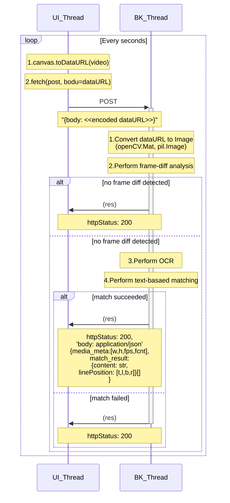

# Backend alpha system development

## Domains

### Converter

To convert any data

- Pdf -> Img : pdf2img
- Img -> Text : img2string
- Ocr linebased fmt -> Matchable fmt : img2string

### Matcher

To match different data

- Text <-> Text (from video frame ,and from document pdf)

### Analyzer

To analyze and get infomation from data

- Basic image analysis: class ImageAnalyzer
- Basic video frame analysis: class VideoFrameDetector extends ImageAnalyzer
- Analyze video activities : class VideoActivityAnalyzer extends VideoFrameDetector

## Sequence between UI thread and Backend thread

### Matching sequence

